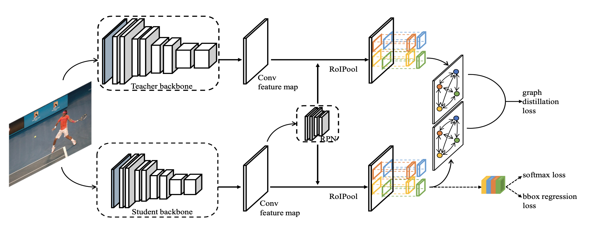

# DSIG

**Deep Structured Instance Graph for Distilling Object Detectors**

**Authors:** Yixin Chen, Pengguang Chen, Shu Liu, Liwei Wang, Jiaya Jia.

[[pdf](https://openaccess.thecvf.com/content/ICCV2021/papers/Chen_Deep_Structured_Instance_Graph_for_Distilling_Object_Detectors_ICCV_2021_paper.pdf)] [[arXiv](http://arxiv.org/abs/2109.12862)] [[supp](https://openaccess.thecvf.com/content/ICCV2021/supplemental/Chen_Deep_Structured_Instance_ICCV_2021_supplemental.pdf)] [[bibtex](#Citation)]



This repo provides the implementation of paper "[Deep Structured Instance Graph for Distilling Object Detectors](https://openaccess.thecvf.com/content/ICCV2021/papers/Chen_Deep_Structured_Instance_Graph_for_Distilling_Object_Detectors_ICCV_2021_paper.pdf)"(Dsig) based on [detectron2](https://github.com/facebookresearch/detectron2). Specifically, aiming at solving the feature imbalance problem while further excavating the missing relation inside semantic instances, we design a graph whose nodes correspond to instance proposal-level features and edges represent the relation between nodes. We achieve new state-of-the-art results on the COCO object detection task with diverse student-teacher pairs on both one- and two-stage detectors.

## Installation

### Requirements

- Python >= 3.6
- Pytorch >= 1.7.0
- Torchvision >= 0.8.1
- Pycocotools 2.0.2

Follow the install instructions in detectron2, note that in this repo we use detectron2 commit version `ff638c931d5999f29c22c1d46a3023e67a5ae6a1`. Download [COCO](https://cocodataset.org/) dataset and  `export DETECTRON2_DATASETS=$COCOPATH` to direct to COCO dataset. We prepare our pre-trained weights for training in `Student-Teacher` format, please follow the instructions in [Pretrained](./projects/Distillation/pretrained/README.md).

## Running 

We prepare training [configs](./projects/Distillation/configs) following the detectron2 format. For **training** a Faster R-CNN R18-FPN student with a Faster R-CNN R50-FPN teacher on 4 GPUs:

```
./start_train.sh train projects/Distillation/configs/Distillation-FasterRCNN-R18-R50-dsig-1x.yaml
```

For **testing**:

```
./start_train.sh eval projects/Distillation/configs/Distillation-FasterRCNN-R18-R50-dsig-1x.yaml
```

For **debugging**:

```
./start_train.sh debugtrain projects/Distillation/configs/Distillation-FasterRCNN-R18-R50-dsig-1x.yaml
```

## Results and Models

**Faster R-CNN:**

| Experiment(Student-Teacher) | Schedule |  AP   |                            Config                            |                            Model                             |
| --------------------------- | :------: | :---: | :----------------------------------------------------------: | :----------------------------------------------------------: |
| R18-R50                     |    1x    | 37.25 | [config](./projects/Distillation/configs/Distillation-FasterRCNN-R18-R50-dsig-1x.yaml) | [googledrive](https://drive.google.com/file/d/12VPna6VEqLGqXRifkcnh848_QRuc624z/view?usp=sharing) |
| R50-R101                    |    1x    | 40.57 | [config](./projects/Distillation/configs/Distillation-FasterRCNN-R50-R101-dsig-1x.yaml) | [googledrive](https://drive.google.com/file/d/1-yUb6eJnUZPxdMU_XCi10hmXhOAVwwO1/view?usp=sharing) |
| R101-R152                   |    1x    | 41.65 | [config](./projects/Distillation/configs/Distillation-FasterRCNN-R101-R152-dsig-1x.yaml) | [googledrive](https://drive.google.com/file/d/1-bUROLlttAu4phgsafEvgy4Sdv_Pqvnj/view?usp=sharing) |
| MNV2-R50                    |    1x    | 34.44 | [config](./projects/Distillation/configs/Distillation-FasterRCNN-MNV2-R50-dsig-1x.yaml) | [googledrive](https://drive.google.com/file/d/1Dxpt9H9WP0KYkM0OE7crmwR3XfwvFupc/view?usp=sharing) |
| EB0-R101                    |    1x    | 37.74 | [config](./projects/Distillation/configs/Distillation-FasterRCNN-EB0-R101-dsig-1x.yaml) | [googledrive](https://drive.google.com/file/d/1AHPIFCNZso8y3hO3EVcEEie9vopcgqHR/view?usp=sharing) |

**RetinaNet:**

| Experiment(Student-Teacher) | Schedule |  AP   |                            Config                            |                            Model                             |
| --------------------------- | :------: | :---: | :----------------------------------------------------------: | :----------------------------------------------------------: |
| R18-R50                     |    1x    | 34.72 | [config](./projects/Distillation/configs/Distillation-RetinaNet-R18-R50-dsig-1x.yaml) | [googledrive](https://drive.google.com/file/d/1ZayyFP34yodgIgieSnG1IxX5p91a23M6/view?usp=sharing) |
| MNV2-R50                    |    1x    | 32.16 | [config](./projects/Distillation/configs/Distillation-RetinaNet-MNV2-R50-dsig-1x.yaml) | [googledrive](https://drive.google.com/file/d/1JnV7oeYwqmfD_GNrh24AqqXBO_Cc2zMB/view?usp=sharing) |
| EB0-R101                    |    1x    | 34.44 | [config](./projects/Distillation/configs/Distillation-RetinaNet-EB0-R101-dsig-1x.yaml) | [googledrive](https://drive.google.com/file/d/1DSrp64E1RtSybympdfgzKh4c72QISAj4/view?usp=sharing) |

More models and results will be released soon.

## Citation

```
@InProceedings{Chen_2021_ICCV,
    author    = {Chen, Yixin and Chen, Pengguang and Liu, Shu and Wang, Liwei and Jia, Jiaya},
    title     = {Deep Structured Instance Graph for Distilling Object Detectors},
    booktitle = {Proceedings of the IEEE/CVF International Conference on Computer Vision (ICCV)},
    month     = {October},
    year      = {2021},
    pages     = {4359-4368}
}
```

## Contact

Please contact yxchen@cse.cuhk.edu.hk.